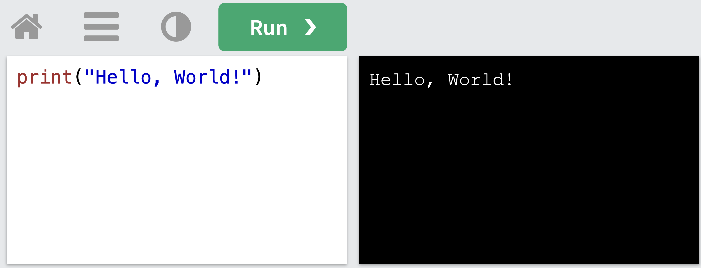

# Get Started With Python

You will write a program that looks like this example:

```
print("Hello World")
```

That is a program! Yes, very simple, but a program it is.

After writing it, you need to run it. For that you need a computer that understands the language called __Python__.

Your own phone, laptop or tablet does not know how to run Python programs (yet). So for now, you can use someone else's computer, and it is 100% free! Nice!

Open this link:

[W3CSchools Playground](https://www.w3schools.com/python/trypython.asp?filename=demo_default)

_Note: W3CSchools is a very good website to remember. You can learn everything that I forget to teach you there. After many years of programming, I still use there website to learn things I forgotten or never used before. Their website is really good and easy to use._

You should see something like this in your browser:



On the left you can type a python program. It already has the simple program from above. On the right you can see what the program does.

If you want to change the program, you can do so:
* Change only the `"Hello, World!"` to be `"anything else"` and then click on `[Run>]`. The right side will change.
* You have to keep the `print("   ")` part of the program, but the text between the `"  "` you can change.

Simple.

[NEXT: Learn about Values](./ValuesWithPython.md)