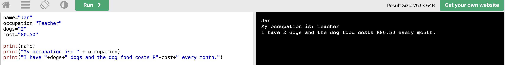

# Pretty Print #

In the previous section we did a lot of stuff to add strings together to print something nice. That worked, but the program was difficult to understand like this:

```
dogs="2"
cost="80.50"
print("I have "+dogs+" dogs and the dog food costs R"+cost)

```

It also required my values to be strings, because one cannot add numbers and strings to each other.

There is a much better way to write your values. Python calls it `f-strings`.

Basically you put a little `f` before the quotes and then put all the variables in _curly braces_ like `{dogs}` and `{cost}`.

Using `f-strings`, we can write the same program as:

```
dogs="2"
cost="80.50"
print(f"I have {dogs} dogs and the dog food costs R{cost}")
```

Notice the changes:
```
print(f"I have {dogs} dogs and the dog food costs R{cost}")
      ^          ^                                   ^
      |          |                                   |
      |          +--- variable                       +--- variable
      |
      +--little f to indicate this is an f-string
```

Try it in the :

```
dogs="2"
cost="80.50"
print(f"I have {dogs} dogs and the dog food costs R{cost}")
```

Now remove the quotes from the numbers and try again. You can do both programs together like this:
```
dogs="2"
cost="80.50"
print(f"I have {dogs} dogs and the dog food costs R{cost}")

dogs=2
cost=80.50
print(f"I have {dogs} dogs and the dog food costs R{cost}")
```

Notice both worked, but the output is slightly different at the end:
```
I have 2 dogs and the dog food costs R80.50
I have 2 dogs and the dog food costs R80.5
```

When a number is written like `cost=80.50`, Python stores the numeric value which is 80 and a half, which is written as `80.5`, and there will be no extra `0` at the end, unless you tell Python that you want it.

It may be annoying now that the `0` was taken away, but it is also a good thing. Using numbers you can tell Python exactly you to print the number. You can even take the `.5` away, or make it `80.5000` if you want. Having this control makes it possible to print a long list of numbers on a till slip, all looking the same, all with 2 digits after the dot, like:

```
 80.50
 12.11
  1.00
  0.30
100.20
```

If you used strings for those, it would be very difficult to get them all align above each other, all the dots in a straigh line, and all with two digits after the dot. But that is why you want to use numeric values for all your numbers, then Python can do the work for you.

To get that kind of formatting, we say something like this. I put a `XX` before and `YY` after each number just so that you can see the spacing that is printed as part of the value in each case:
```
cost=12.2
print(f"XX{cost}YY")
print(f"XX{cost:10}YY")
print(f"XX{cost:10.3f}YY")
print(f"XX{cost:.3f}YY")
print(f"XX{cost:.5}YY")
```

Let me explain each one:

Without formatting, just the numeric value of `12.1` is printed, so you get `XX12.2YY` as output:
```
print(f"XX{cost}YY")
```

When we add `:10` to the formatting, it says the width that the value must have. The width is achieve by Python autmoatically printing spaces before the value, so here it prints `XX      12.2YY` (with 6 spaces and then the value of four digits namely 12.2):
```
print(f"XX{cost:10}YY")
```
It prints:
```
XX      12.2YY
        7890 = four digits is the actual value
  123456     = six spaces added to the front
```

Then we can also say how many digits after the number using a '.' and a number and an 'f' like this:

```
print(f"XX{cost:10.3f}YY")
```

That will print 10 digits wide, using 3 digits after the dot, so you get:

```
XX    12.200YY
      567890 = 6 digits used in the value
  1234       = 4 spaces to make it 10 wide
```

We can also just specify the number of digits after the dot, without a width. Now we will still see `12.200` but there will be no spaces added to push out the width:

```
print(f"XX{cost:.3f}YY")
```

The output is:

```
XX12.200YY
```

You can play a bit with that in the [Playground](https://www.w3schools.com/python/trypython.asp?filename=demo_default)
. Try wider than 10. Try less than 10. Try different number of digits after the dot. Try with 0 digits after the dot...

We will use this later on a lot and then you will get more practice.

[NEXT Ask the user some Questions](./InputWithPython.md)