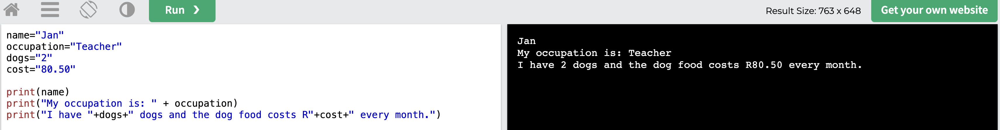

# Variables #

## Learn ##

A `variable` is a place where the program stores a value. After storing it, it can use the variable's value over and over again to do many things with it.

For example, your program takes someone's name. It stores the name in a variable, and then uses the name in the greeting, when it asks you questions, when it prints an invoice and at the end to say goodbye.

The program can also store your date of birth, or the price of the item you want to buy or anything else!

Because their can and will be many variables, each one must have its own `unique` name.

You store values in variables in what we call an `assignment` like these:

- `name="Jan"`
- `occupation="Teacher"`
- `dogs=2`
- `cost=80.50`

That defines four different variables and stores the values in them.

You can paste it into the [Playground](https://www.w3schools.com/python/trypython.asp?filename=demo_default)
 as a program and run it:

 ```
name="Jan"
occupation="Teacher"
dogs="2"
cost="80.50"
```

When you `[Run>]` that program you might be dissapointed because it does not print anything!

That is only because we did not tell it to print anything, yet! Here we go. This is where it gets interesting...

```
name="Jan"
occupation="Teacher"
dogs="2"
cost="80.50"

print(name)
print("My occupation is: " + occupation)
print("I have "+dogs+" dogs and the dog food costs R"+cost)
```

The output is like this:



Some important things to note before moving on:

1. When I defined my variables, I quoted all the values, even the numbers like `dogs="2"` instead of simply `dogs=2`. This was so that I can add them to other strings like `"I have "+dogs+" dogs..."`. If they were real numbers like `dogs=2`, they cannot be added to strings... more about that later.
1. Also make sure you understand this bit `"I have "+dogs+" dogs."`.
    - It starts with `"I have "`
    - Then adds the values from the variable calls `dogs` which is `"2"`,
    - Then also adds the words `" dogs and ..."`.
    - So it prints it all together as one string `"I have 2 dogs and ..."`.
    - Note the space inside the quotes at the end of `"I have "`. If there was no space, the result would be `"I have2 dogs and ..."` which does not read well. You have to tell the program about the space like I did. The computer is not clever.
    - In the same way there is a space after the `2` because I added it at the start of `" and ..."` otherwise the result would be `"2and ..."` which also is not nice.

To be clear, the spaces were added here:
```
print("I have "+dogs+" dogs and the dog food costs R"+cost)
             ^        ^
             |        |
```

[NEXT An easier way to pretty print...](./PrettyPrintWithPython.md)